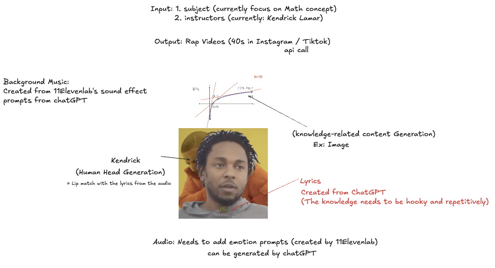
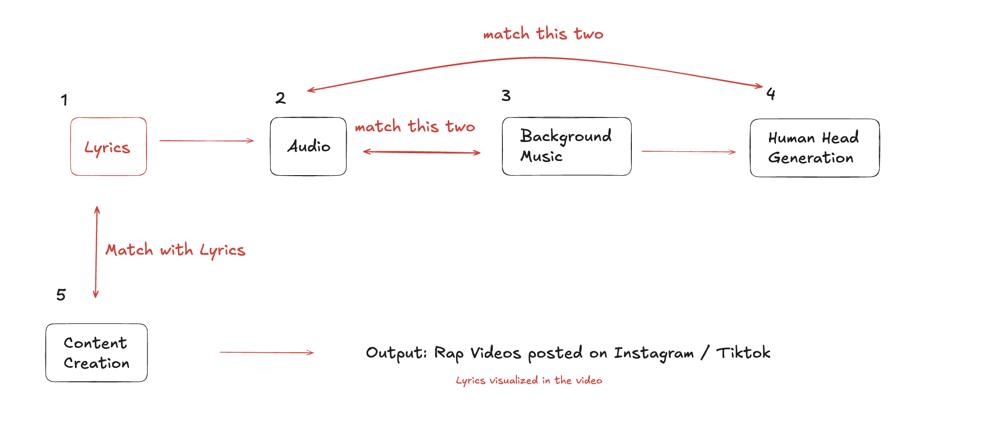

# AI-Powered Educational Rap Video Generation Pipeline


- Automated pipeline that turns an educational topic into a short-form rap video for platforms such as Instagram Reels and TikTok. The system combines lyric generation, voice synthesis, music generation, talking head video synthesis, subtitle alignment, and final video rendering into one workflow.

- **Demo:** [Instagram Post](https://www.instagram.com/know.unity.testbot/)

- **Hackathon:** [Hackathon: AI in Consumer](https://luma.com/knowunity-hack?tk=hN45Uu)

- Goal: make knowledge content more engaging, memorable, and easier to consume through short, entertaining videos.

---

## Overview

This project explores how multimodal AI can be used to generate educational media automatically. Given a topic and an instructor persona, the pipeline produces:

1. AI-generated educational rap lyrics
2. synthesized vocal audio
3. generated background music
4. a talking head video with lip-synced animation
5. word-level animated subtitles
6. a final edited short-form video

The heavy compute parts of the pipeline are designed to run on **Modal**, using GPU-backed infrastructure for model inference and video generation.

---

## Demo

You can view a sample output here: [Instagram Demo](https://www.instagram.com/know.unity.testbot/)

You can also include project visuals in this repository:




---

## ⭐ My Contributions

This repository was developed as a team project. My main contributions focused on the Python pipeline and inference workflow.

My work included:

1. building and maintaining core Python scripts for the generation pipeline
2. integrating **Modal** for remote GPU inference
3. adapting and running inference based on **Real3D-Portrait**
4. connecting the steps across lyrics, audio, talking head generation, subtitles, and final rendering
5. helping structure the end-to-end workflow so the system could produce short educational rap videos from prompts

---

## Pipeline

The workflow consists of several stages:

### 1. Lyric Generation
An LLM generates short, catchy educational rap lyrics from a user-provided topic.

### 2. Voice Synthesis
The lyrics are converted into vocal audio using a text-to-speech system.

### 3. Music Generation
A background beat is generated to match the style and pacing of the vocals.

### 4. Talking Head Synthesis
A talking portrait video is generated using **Real3D-Portrait**, with lip movements synchronized to the generated audio.

### 5. Subtitle Alignment
The audio is transcribed with **whisper-timestamped** to obtain word-level timestamps for subtitle animation.

### 6. Final Rendering
The final short-form video is rendered with subtitles, audio, and generated visuals using video processing tools.

---

## Tech Stack

This project integrates several tools and models:

- **Python**
- **Modal** for remote GPU inference
- **Real3D-Portrait** for talking head generation
- **whisper-timestamped** for word-level subtitle timing
- **FFmpeg** for media processing
- **MoviePy** for video assembly and rendering
- **Docker** for reproducible environment setup

---

## Model and Infrastructure

### Talking Head Generation
This project uses the model from the ICLR 2024 Spotlight paper: **Real3D-Portrait: One-shot Realistic 3D Talking Portrait Synthesis**  [Paper Link](https://arxiv.org/abs/2401.08503)

### Cloud Compute
The main inference workflow runs on **Modal**, which allows the pipeline to use containerized GPU environments on demand.

### Reproducibility
A **Dockerfile** is included to make the software environment more reproducible across systems.

---

## Repository Structure

```
Knowunity_project/
├── Dockerfile
├── README.md
├── .gitignore
├── docs/
│   └── images/
│       ├── idea.png
│       └── workflow.png
├── data/
│   ├── input/
│   │   ├── audio/
│   │   │   ├── examples/
│   │   │   ├── reference/
│   │   │   ├── rap_nomusic_66s.wav
│   │   │   └── rap_with_music_66s.mp3
│   │   ├── images/
│   │   │   └── examples/
│   │   └── video/
│   │       ├── examples/
│   │       └── kendrick14s.mp4
│   ├── processed/
│   │   ├── audio/
│   │   │   └── rap_with_music_66s_16khz.wav
│   │   └── video/
│   │       └── kendrick14s_512x512.mp4
│   └── sample_output/
├── notebooks/
│   ├── add_subtitles.ipynb
│   └── knowunity-project_Poyen.ipynb
├── output/
│   ├── audio/
│   ├── text/
│   ├── subtitles/
│   └── video/
├── logs/
├── src/
│   ├── helpers/
│   ├── add_subtitles_modal.py
│   ├── generate_content.py
│   ├── post_to_instagram.py
│   ├── preprocess_data.py
│   └── run_modal.py
└── tests/
    ├── test_repo_structure.py
    └── test_readme.py
```

## Setup

Clone your fork of the repository:
```
git clone https://github.com/isthatgopro/Knowunity_project.git
cd Knowunity_project
```

Install Modal:
```
pip install modal
```
Authenticate Modal:
```
modal token new
```
Make sure your Modal account has the required secrets configured, such as a Hugging Face token if needed by the model pipeline.

## How to Run

This project is designed so that local scripts orchestrate the workflow while the heavier inference steps run remotely on Modal.

## Tests

This repository includes lightweight checks for project structure and documentation.

Run tests with:

```
pip install pytest
pytest -q
```

### Step 1: Preprocess input data

Prepare the input audio and video files:
```
python src/preprocess_data.py \
  --input-dir data/raw \
  --output-dir data/processed \
  --audio-file your_audio.mp3 \
  --video-file your_video.mp4
```
This step converts raw input files into formats suitable for downstream inference.

### Step 2: Generate the talking head video

Run the main Modal pipeline:
```
python src/run_modal.py \
  --src-img data/raw/your_source_image.png \
  --drv-aud data/processed/your_audio_16khz.wav \
  --drv-pose data/processed/your_video_512x512.mp4 \
  --bg-img data/raw/your_background.png \
  --out-name my_video.mp4
```
This step generates the main video output and saves it to output/.

### Step 3: Add dynamic subtitles

Generate word-level subtitles and render the final shareable video:
```
python src/add_subtitles_modal.py \
  --input-video output/my_video.mp4 \
  --output-video output/my_video_with_subs.mp4 \
  --gpu T4 \
  --model medium
```
The final output will be saved in the output/ directory.

## Example Use Case

A user provides:
- a subject, such as a math concept
- an instructor persona or character style
- supporting media assets if needed

The system then generates a short educational rap video that explains the topic through lyrics, audio, and a talking head presentation.

## Limitations

This project is currently a prototype and has several limitations:

output quality depends on prompt quality and input assets
subtitle timing and lip sync quality may vary
generated media may still require manual review
the workflow is built primarily for experimentation and demos rather than production deployment
some steps depend on external APIs, model availability, or cloud setup

## What I Learned

Through this project, I gained hands-on experience with:

- building and debugging a multimodal generation pipeline
- orchestrating remote GPU inference with Modal
- integrating research models into a working application pipeline
- handling practical issues in audio, video, and subtitle processing
- designing a project that connects machine learning outputs to a user-facing demo

## Acknowledgements
- The talking head generation component is based on the work of the Real3D-Portrait authors.
- Cloud GPU infrastructure was provided through Modal
- This repo reflects a collaborative team project, with my main contributions centered on Python pipeline development and inference integration